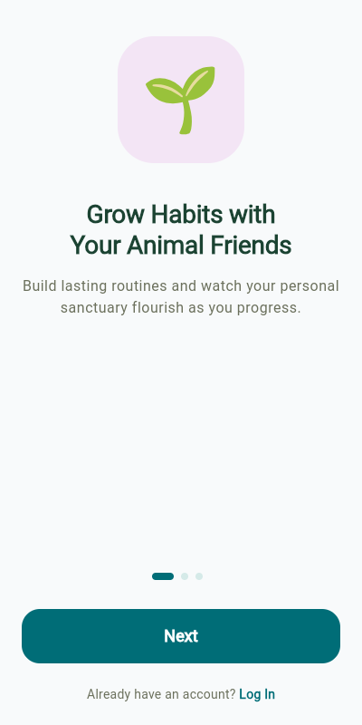
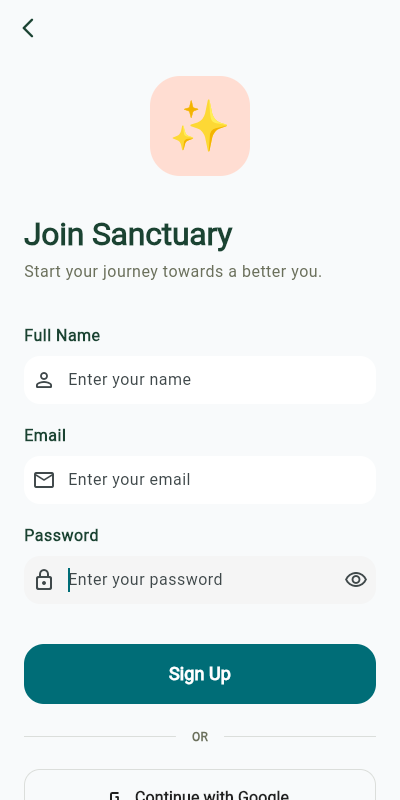
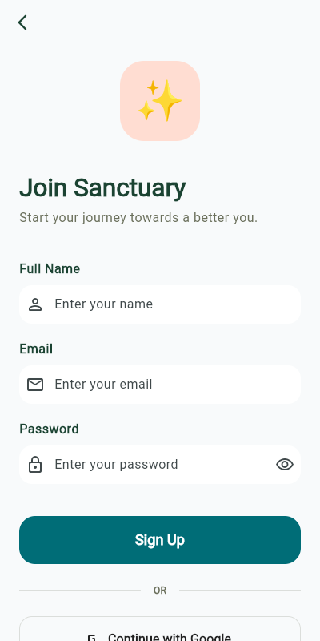
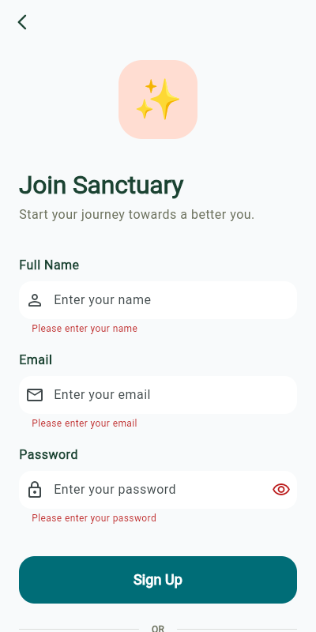

# HabitFlow 🌿

**HabitFlow** is a gamified habit-tracking application built with Flutter, designed to help users cultivate lasting habits through AI-driven insights, mascot-led motivation, and an immersive focus environment. It combines the power of OpenAI's GPT-4o-mini for personalized coaching with a robust Supabase backend.

<p align="center">
  
  
</p>

## 🚀 Key Features

### 🧠 AI Habit Refiner
Stop setting vague goals. Our AI refiner takes your simple habit ideas and transforms them into specific, actionable, and measurable tasks. It also automatically categorizes your habits to keep your life organized.

### 🦊 Mascot Personalities
Choose from seven unique AI mascot personalities to guide your journey. Each mascot offers a different coaching style:
- **🐼 Panda**: Zen and mindful.
- **🐧 Penguin**: Disciplined and consistent.
- **🐨 Koala**: Focused on rest and recharge.
- **🦊 Fox**: Strategic and efficient.
- **🐱 Cat**: Independent and curious.
- **🐶 Dog**: Enthusiastic and loyal.
- **🐻 Bear**: Strong and protective.

### 🎵 Focus Hub
Enter a state of deep work with the Focus Hub.
- **Curated Music**: Integrated with the **Free To Use Music API** to provide the perfect background tracks for your tasks.
- **AI Pep Talks**: Your mascot provides real-time, personality-driven encouragement in speech bubbles to keep you motivated.

### 🎮 Gamification & Progression
- **Level Up**: Earn 50 XP for every habit completion.
- **Milestones**: Unlock achievements as you progress.
- **Global Ranking**: See how you stack up against the community based on your level and XP.
- **Evolution**: Watch your mascot evolve as you strengthen your habits.

### 📊 Advanced Analytics
Track your consistency with detailed streak statistics, total completions, and a weekly history view.

### 🔔 Smart Reminders
Never miss a beat with customizable start and end reminders for every habit, powered by `flutter_local_notifications`.

---

## 🛠 Tech Stack

- **Frontend**: [Flutter](https://flutter.dev/) (Dart)
- **Backend/Auth**: [Supabase](https://supabase.com/) (PostgreSQL, Auth, RLS)
- **AI Integration**: [OpenAI API](https://openai.com/) (GPT-4o-mini via `openai_dart`)
- **State Management**: Reactive Streams & Provider-like patterns with Supabase listeners.
- **Audio**: `just_audio` for the Focus Hub music.
- **External APIs**: [Free To Use Music API](https://freetouse.com/) for royalty-free tracks.
- **Local Notifications**: `flutter_local_notifications` with timezone support.

---

## 📂 Project Structure

```text
lib/
├── models/         # Data models (HabitModel, Profile, Music, etc.)
├── screens/        # UI Screens (Home, Focus Hub, Habit Detail, Statistics, etc.)
├── services/       # Business logic & API (Auth, Database, AI, Music, Notifications)
├── utils/          # Constants, themes, and navigation helpers
├── widgets/        # Reusable UI components (MainNavigation, etc.)
└── main.dart       # Application entry point and Auth Wrapper
```

---

## 🏁 Getting Started

### Prerequisites

- [Flutter SDK](https://docs.flutter.dev/get-started/install) (v3.11.0 or higher)
- A [Supabase](https://supabase.com/) Project
- An [OpenAI](https://platform.openai.com/) API Key

### Installation & Setup

1.  **Clone the repository:**
    ```bash
    git clone https://github.com/your-username/habitflow.git
    cd habitflow
    ```

2.  **Install dependencies:**
    ```bash
    flutter pub get
    ```

3.  **Database Configuration:**
    - Go to your Supabase Project -> SQL Editor.
    - Copy the contents of `supabase_schema.sql` from the root of this project and run it. This sets up the `profiles`, `habits`, `habit_completions`, and `milestones` tables, along with the necessary triggers for user creation.

4.  **Environment Variables:**
    Update `lib/utils/constants.dart` with your specific credentials:
    ```dart
    class SupabaseConstants {
      static const String SUPABASE_URL = 'YOUR_SUPABASE_URL';
      static const String SUPABASE_ANON_KEY = 'YOUR_SUPABASE_ANON_KEY';
    }

    class OpenAIConstants {
      static const String OPENAI_API_KEY = 'YOUR_OPENAI_API_KEY';
    }
    ```

5.  **Run the application:**
    ```bash
    flutter run
    ```

---

## 📸 Screenshots

| Onboarding | Login | Sign Up | Home |
| :---: | :---: | :---: | :---: |
|  |  |  |  |

---

## 📄 License

This project is licensed under the MIT License - see the `LICENSE` file for details.

## 🙏 Acknowledgments

- Music provided by [Free To Use Music](https://freetouse.com/).
- AI capabilities powered by [OpenAI](https://openai.com/).
- Backend infrastructure by [Supabase](https://supabase.com/).
